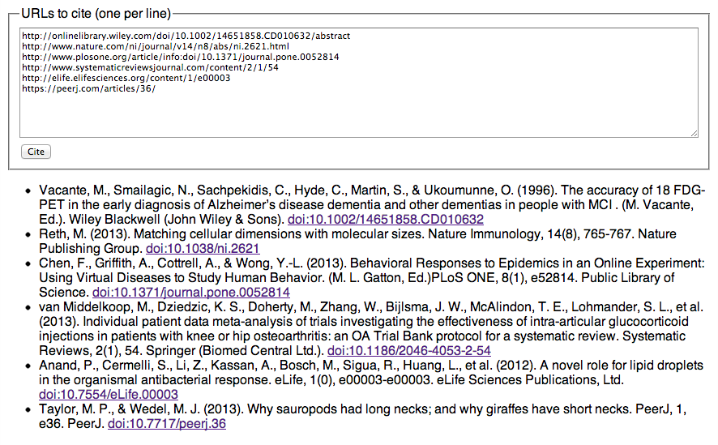

[@bengoldacre](https://twitter.com/bengoldacre/status/366657597190832129): Is there a website where you can paste 20 academic journal URLs in one go and get a list of nice APA/Harvard/whatevs citations back?

## Instructions (for Chrome)

 * [Download this project as a zip file](https://github.com/hubgit/cite-urls/archive/master.zip) and extract it.

 * Chrome > Tools > Extensions, check "Developer mode", click "Load unpacked extension...", choose the "extension" directory in the extracted project.

 * Click the new button in Chrome's toolbar, enter some URLs, and press "Cite".

 

## Notes

 * Currently only works if a DOI can be detected.
 * May sometimes detect an incorrect DOI.
 * May sometimes receive incorrect metadata.
 * TODO: allow output format to be selected.
 * TODO: scrape metadata from the page.
 * TOOD: generate citation locally using citeproc-js.
